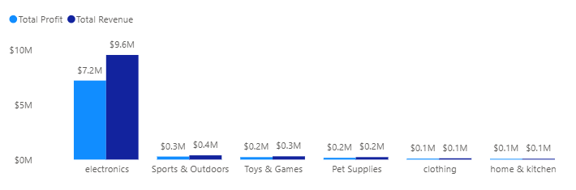
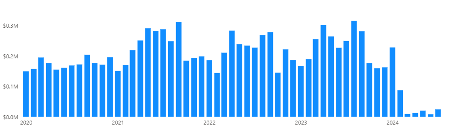
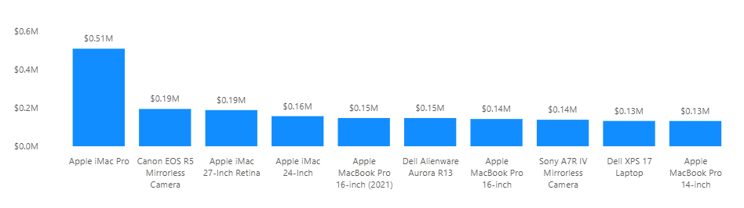
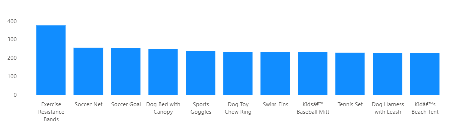
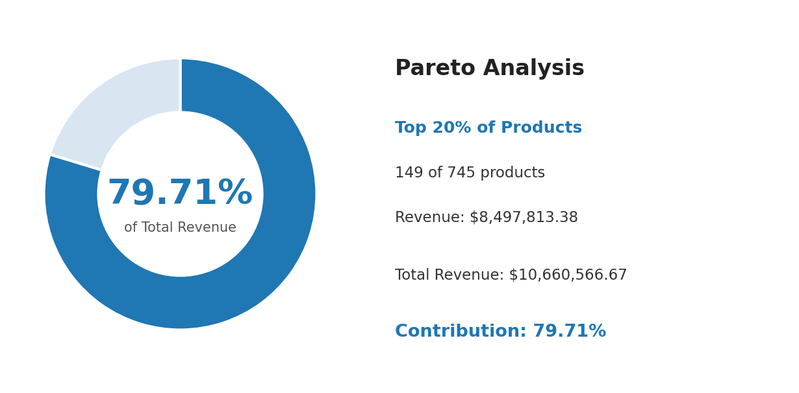
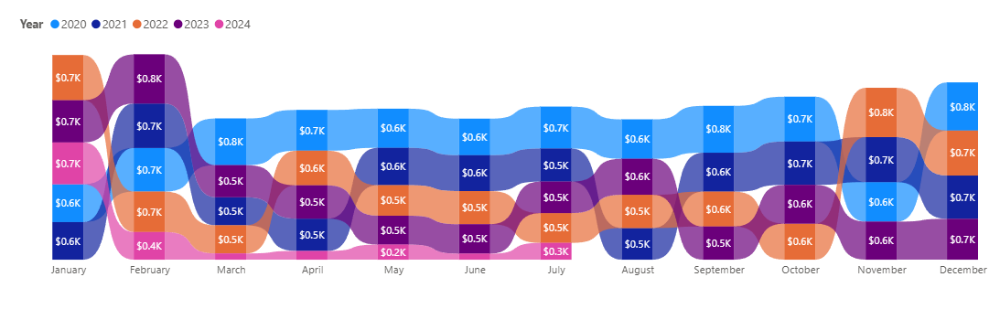
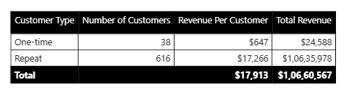

## Project Overview

This project analyses Amazon marketplace data using SQL as the primary analytical tool, with Power BI used only to visualize the resulting findings. It is designed to demonstrate strong SQL fundamentals, from data validation through advanced query techniques, applied to a real-world business analyst use case.

The dataset spans **9 relational tables** (Category, Products, Sellers, Inventory, Customers, Orders, Order_items, Payments, Shipping) covering **approximately 21,630 orders from January 2020 to July 2024**, loaded into a MySQL database (`Amazon_DB`).

The project is structured in two parts:

### 1. Data Validation & Trust Checks

Before any business analysis, the dataset is systematically validated. This includes checking referential integrity across all table relationships, identifying duplicates, and confirming there are no nulls or zero-values in fields critical to revenue and margin calculations. This step surfaced several genuine, non-error findings (for example, **212 customers who never placed an order**, and **488 cancelled orders with no shipping record**) that later fed directly into the business analysis.

### 2. 18 Business Questions

Organized across five sections (Sales & Revenue Performance, Customer Behaviour, Seller & Marketplace Performance, Operations, and Advanced/Strategic Synthesis), each question is answered with a documented SQL query, a plain-language insight explaining the finding, and a corresponding Power BI visualization. Techniques used include multi-table joins, CTEs, subqueries, conditional aggregation, and window functions such as `RANK()`, `ROW_NUMBER()`, and running totals with `PARTITION BY`.

**Key findings include:** Electronics drives **approximately 90% of total profit** despite being one of six categories. Ohio and Texas together account for **about 88% of total revenue**. Repeat customers generate **roughly 27 times more revenue** than one-time buyers. One shipping provider (Bluedart) shows a **near-total delivery failure rate**, flagged as a critical operational risk.

**Tools used**: MySQL (database and analysis), Power BI (visualization layer only).

## Business Objective

Amazon operates a large, multi-category marketplace connecting thousands of sellers with customers across the country. As the business scales, leadership needs visibility into where revenue and profit actually come from, which customers and sellers drive sustainable growth, and where operational risks such as payment failures or delivery breakdowns might be quietly eroding performance.

This project takes on the role of a business analyst tasked with answering that need. Using SQL to extract, validate, and analyze marketplace data, **the goal is to uncover actionable insights across sales performance, customer retention, seller reliability, and fulfilment operations.** The focus is not just on reporting numbers, but on identifying patterns, risks, and opportunities that could directly inform business strategy, such as diversification away from over-concentrated revenue sources, retention-focused customer initiatives, and vendor and provider performance reviews.

## Dataset

The dataset represents an Amazon-style e-commerce marketplace, structured across **9 relational tables** in a MySQL database (`Amazon_DB`). It covers approximately **21,630 orders placed between January 2020 and July 2024**, along with the customers, sellers, products, and fulfilment records tied to those orders.

| Table | Description |
|---|---|
| **Category** | Product category names (6 categories: Electronics, Clothing, Home & Kitchen, Sports & Outdoors, Pet Supplies, Toys & Games) |
| **Products** | Product name, price, cost of goods sold (COGS), and category |
| **Sellers** | Seller name and country of origin |
| **Inventory** | Stock levels and last restock date per product |
| **Customers** | Customer name and state |
| **Orders** | Order date, linked customer and seller, and order status (Completed, Cancelled, Returned, In Progress) |
| **Order_items** | Line-item detail for each order, including quantity and price per unit |
| **Payments** | Payment date and status (Payment Succussed, Payment Failed, Refunded) |
| **Shipping** | Shipping date, return date, shipping provider, and delivery status |

### Entity Relationship Diagram

.png)

All table relationships shown above were fully validated in the Data Validation & Trust Checks section before any analysis was performed, confirming referential integrity across the schema with no orphaned records.

**Data quality note:** Revenue data becomes unreliable after January 2024, dropping by approximately 95% and never recovering through the end of the dataset. This is treated as a data completeness limitation rather than a genuine business trend, and is flagged accordingly wherever it affects a finding (see Q2 and Q7).

## Tools & Technologies

- **MySQL** — database creation, data loading, and all analytical queries (joins, CTEs, subqueries, window functions, views)
- **Power BI** — visualization layer only, used to chart the results of each SQL query

## Project Structure

This project is organized as a single, linear document — each business question is presented with its SQL query, a Power BI visualization of the result, and a written finding, in that order. The structure moves from validating the data to answering progressively more advanced business questions.

**1. Data Validation & Trust Checks**
Foundational checks confirming the dataset is reliable before analysis begins:
- Relationship Integrity Checks (foreign key validation across all 6 table pairs)
- Duplicates (primary key and one-to-one relationship checks)
- Nulls / Zeros (fields critical to revenue and margin calculations)

**2. Business Questions (Q1–Q18)**
Organized into five sections, each grouping related questions and increasing in analytical complexity:

| Section | Questions | Focus |
|---|---|---|
| Sales & Revenue Performance | Q1–Q5 | Category profitability, revenue trends, top products, Pareto analysis, AOV |
| Customer Behavior | Q6–Q9 | Repeat vs. one-time buyers, top customers, revenue by state, order frequency |
| Seller & Marketplace Performance | Q10–Q13 | Seller revenue, performance by origin, cancellation/return rates |
| Operations: Shipping & Payments | Q14–Q16 | Payment failure rates, delivery success by provider, return rate by category |
| Advanced / Strategic Synthesis | Q17–Q18 | Top product per category (window functions), cumulative revenue trend |

## Data Validation & Trust Checks

### Relationship Integrity Checks

Verified referential integrity across all 6 foreign key relationships in the schema, checking each pair in both directions using LEFT JOIN anti-joins.

**Orders ↔ Customers**
```sql
-- Does every customer have at least one order?
select count(*) from Customers c
left join Orders o on c.Customer_id = o.Customer_id
where o.Customer_id is null;

-- Does every order point to a real, existing customer?
select count(*) from Orders o
left join Customers c on o.Customer_id = c.Customer_id
where c.Customer_id is null;
```
**Finding:** 212 customers (23.6% of the customer base) have never placed an order. This is not a data issue, simply customers who signed up but never purchased. No orphaned orders were found; every order is tied to a valid customer.

**Orders ↔ Order_items**
```sql
-- Does every order have at least one order item?
select count(*) from Orders o
left join Order_items oi on o.Order_id = oi.Order_id
where oi.Order_id is null;

-- Does every order item point to a real order?
select count(*) from Order_items oi
left join Orders o on oi.Order_id = o.Order_id
where o.Order_id is null;
```
**Finding:** Full referential integrity confirmed. Every order has at least one item, and every order item points to a valid order.

**Order_items ↔ Products**
```sql
-- Does every order item reference a real, existing product?
select count(*) from Order_items oi
left join Products p on oi.Product_id = p.Product_id
where p.Product_id is null;

-- Is there any product that has never been ordered?
select count(*) from Products p
left join Order_items oi on p.Product_id = oi.Product_id
where oi.Product_id is null;
```
**Finding:** All order items reference valid products. However, 15 products (out of 765) have never been ordered, worth flagging as potentially new, discontinued, or underperforming listings.

**Products ↔ Category**
```sql
-- Does every product belong to a real, existing category?
select count(*) from Products p
left join Category c on p.Category_id = c.Category_id
where c.Category_id is null;

-- Is there any category with no products in it?
select count(*) from Category c
left join Products p on c.Category_id = p.Category_id
where p.Product_id is null;
```
**Finding:** Every product is linked to a valid category, and every category contains at least one product. No orphaned records.

**Payments ↔ Orders**
```sql
-- Does every payment point to a real order?
select count(*) from Payments pay
left join Orders o on pay.Order_id = o.Order_id
where o.Order_id is null;

-- Does every order have a payment?
select count(*) from Orders o
left join Payments pay on o.Order_id = pay.Order_id
where pay.Order_id is null;
```
**Finding:** Every payment is linked to a valid order, and every order has a corresponding payment. No broken links in either direction.

**Shipping ↔ Orders**
```sql
-- Does every shipping record point to a real order?
select count(*) from Shipping s
left join Orders o on s.Order_id = o.Order_id
where o.Order_id is null;

-- Does every order have a shipping record?
select count(*) from Orders o
left join Shipping s on o.Order_id = s.Order_id
where s.Order_id is null;
```
**Finding:** Every shipping record is linked to a valid order. However, 488 orders have no shipping record. Further investigation confirmed all 488 are Cancelled orders, which correctly never shipped. This is expected behavior, not a data error.

**Overall Result:** Full referential integrity confirmed across all 6 table pairs. No broken foreign key relationships were found anywhere in the schema.

---

### Duplicates

Checked for duplicate primary keys and confirmed one-to-one relationships between Orders and its dependent tables (Payments, Shipping).

**Primary Key Duplicates**
```sql
-- Orders
select Order_id, count(Order_id)
from Orders
group by Order_id
having count(Order_id) > 1;

-- Customers
select Customer_id, count(Customer_id)
from Customers
group by Customer_id
having count(Customer_id) > 1;

-- Products
select Product_id, count(Product_id)
from Products
group by Product_id
having count(Product_id) > 1;
```
**Finding:** No duplicate primary keys found across Orders, Customers, or Products, confirming primary key constraints held correctly on import.

**One-to-One Relationship Checks**
```sql
-- Payments: does any order have more than one payment?
select Order_id, count(Order_id)
from Payments
group by Order_id
having count(Order_id) > 1;

-- Shipping: does any order have more than one shipping record?
select Order_id, count(Order_id)
from Shipping
group by Order_id
having count(Order_id) > 1;
```
**Finding:** No order has more than one payment record, and no order has more than one shipping record, confirming these are true one-to-one relationships as expected.

### Nulls / Zeros in Fields That Matter for Analysis

Checked for missing or zero values in fields critical to revenue, margin, and time-series calculations.

**Products: Price and COGS**
```sql
-- Price or COGS is null
select count(*) from Products
where Price is null or COGS is null;

-- Price or COGS is 0
select count(*) from Products
where Price = 0 or COGS = 0;

-- COGS greater than Price
select count(*) from Products
where COGS > Price;
```
**Finding:** No nulls or zero values in Price or COGS, and COGS never exceeds Price. Margin calculations in the Sales & Revenue section can be trusted, with no risk of negative or broken profit numbers.

**Order_items: Quantity and Price_per_unit**
```sql
-- Quantity or Price_per_unit is null
select count(*) from Order_items
where Quantity is null or Price_per_unit is null;

-- Quantity or Price_per_unit is 0
select count(*) from Order_items
where Quantity = 0 or Price_per_unit = 0;
```
**Finding:** No nulls or zero values in Quantity or Price_per_unit. Revenue calculations from Order_items can be trusted without risk of undercounting or division errors.

**Date Fields: Orders, Payments, Shipping**
```sql
-- Orders: Order_date is null
select count(*) from Orders
where Order_date is null;

-- Payments: Payment_date is null
select count(*) from Payments
where Payment_date is null;

-- Shipping: Shipping_date is null
select count(*) from Shipping
where Shipping_date is null;
```
**Finding:** No missing dates across Orders, Payments, or Shipping. All time-series and trend queries in later sections can run without risk of gaps or broken date logic.

---

**Data Validation Summary:** All checks across Relationship Integrity, Duplicates, and Nulls/Zeros came back clean, with three genuine (non-error) findings carried forward into the business analysis: 212 customers who never ordered, 15 products never sold, and 488 cancelled orders with no shipping record.

## Business Questions Answered

### Section 1: Sales & Revenue Performance

#### Q1: What is total revenue and profit by category, and which categories are most profitable?

**Query:**
```sql
select c.Category_name, 
       sum(oi.Quantity * oi.Price_per_unit) as Total_Revenue,
       sum(oi.Quantity * (oi.Price_per_unit - p.COGS)) as Total_Profit,
       round(sum(oi.Quantity * (oi.Price_per_unit - p.COGS)) * 100.0 / 
             (select sum(oi2.Quantity * (oi2.Price_per_unit - p2.COGS))
              from Order_items oi2
              join Products p2 on oi2.Product_id = p2.Product_id
              join Orders o2 on oi2.Order_id = o2.Order_id
              join Payments pay2 on o2.Order_id = pay2.Order_id
              where pay2.Payment_status = 'Payment Successed'), 2) as Profit_Contribution_Pct
from Order_items oi
join Products p on oi.Product_id = p.Product_id
join Category c on p.Category_id = c.Category_id
join Orders o on oi.Order_id = o.Order_id
join Payments pay on o.Order_id = pay.Order_id
where pay.Payment_status = 'Payment Successed'
group by c.Category_name;
```

**Visualization:**



**Finding:**
Electronics contributes nearly 90% of total profit (89.96%), an extreme concentration. Every other category combined accounts for roughly 10%. This signals a significant business risk: any disruption to Electronics (supply issues, demand shift, increased competition) would have an outsized impact on overall profitability. Diversification could be a strategic recommendation worth raising.

#### Q2: What are the monthly revenue trends over the last 4+ years, and is there any seasonality or decline?

**Query:**
```sql
select date_format(o.Order_date, '%Y-%m') as Order_Month,
       sum(oi.Quantity * oi.Price_per_unit) as Total_Revenue
from Order_items oi
join Orders o on oi.Order_id = o.Order_id
join Payments pay on o.Order_id = pay.Order_id
where pay.Payment_status = 'Payment Successed'
group by date_format(o.Order_date, '%Y-%m')
order by Order_Month;
```

**Visualization:**



**Finding:**
Revenue holds steady between $2.0M–$2.8M per year from 2020–2023, with mild seasonal dips in Jan–Feb and a modest peak in late summer. However, revenue collapses by roughly 95% starting February 2024 and never recovers through July 2024, the end of the dataset. This is almost certainly a data completeness artifact, since the dataset appears to stop being reliably populated after January 2024, rather than a genuine business decline.

#### Q3: What are the top 10 best-selling products by revenue, and do they differ from the top 10 by quantity sold?

**Query:**
```sql
-- Top 10 by revenue
select p.Product_name, 
       sum(oi.Quantity * oi.Price_per_unit) as Total_Revenue
from Order_items oi
join Products p on oi.Product_id = p.Product_id
join Orders o on oi.Order_id = o.Order_id
join Payments pay on o.Order_id = pay.Order_id
where pay.Payment_status = 'Payment Successed'
group by p.Product_name
order by Total_Revenue desc
limit 10;

-- Top 10 by quantity sold
select p.Product_name, 
       sum(oi.Quantity) as Total_Quantity_Sold
from Order_items oi
join Products p on oi.Product_id = p.Product_id
join Orders o on oi.Order_id = o.Order_id
join Payments pay on o.Order_id = pay.Order_id
where pay.Payment_status = 'Payment Successed'
group by p.Product_name
order by Total_Quantity_Sold desc
limit 10;
```

**Visualization:**

*Top 10 Products by Revenue*



*Top 10 Products by Quantity Sold*



**Finding:**
The top 10 products by revenue and top 10 by quantity sold have zero overlap. Revenue leaders are premium, low-volume electronics (Apple iMacs, MacBook Pros, high-end cameras), consistent with Electronics driving ~90% of total profit. Quantity leaders are inexpensive, high-volume items from Sports & Outdoors and Pet Supplies (resistance bands, soccer nets, dog beds). This confirms two distinct business dynamics: a small number of expensive electronics driving revenue and profit, while cheaper accessory-type products drive order volume and frequency.

#### Q4: What percentage of total revenue comes from the top 20% of products?

**Query:**
```sql
with Product_Revenue_Ranked as (
    select p.Product_name,
           sum(oi.Quantity * oi.Price_per_unit) as Product_Revenue,
           row_number() over (order by sum(oi.Quantity * oi.Price_per_unit) desc) as Revenue_Rank
    from Order_items oi
    join Products p on oi.Product_id = p.Product_id
    join Orders o on oi.Order_id = o.Order_id
    join Payments pay on o.Order_id = pay.Order_id
    where pay.Payment_status = 'Payment Successed'
    group by p.Product_name
)
select 
    sum(case when Revenue_Rank <= 149 then Product_Revenue else 0 end) as Top20pct_Revenue,
    sum(Product_Revenue) as Total_Revenue,
    round(sum(case when Revenue_Rank <= 149 then Product_Revenue else 0 end) * 100.0 / sum(Product_Revenue), 2) as Top20pct_Contribution_Pct
from Product_Revenue_Ranked;
```

**Visualization:**



**Finding:**
The top 20% of products (149 of 745) generate 79.71% of total revenue, closely matching the classic 80/20 Pareto pattern. This reinforces that revenue is highly concentrated in a relatively small set of high-value products, mostly premium electronics. From a strategy standpoint, protecting and growing this core product set matters far more than trying to boost the long tail of lower-revenue products.

#### Q5: How does average order value (AOV) trend month over month?

**Query:**
```sql
select date_format(o.Order_date, '%Y-%m') as Order_Month,
       sum(oi.Quantity * oi.Price_per_unit) as Total_Revenue,
       count(distinct o.Order_id) as Total_Orders,
       round(sum(oi.Quantity * oi.Price_per_unit) / count(distinct o.Order_id), 2) as AOV
from Order_items oi
join Orders o on oi.Order_id = o.Order_id
join Payments pay on o.Order_id = pay.Order_id
where pay.Payment_status = 'Payment Successed'
group by date_format(o.Order_date, '%Y-%m')
order by Order_Month;
```

**Visualization:**



**Finding:**
AOV was consistently highest in 2020, particularly in January and February, and structurally declined from 2021 onward as order volume increased. 2024 sits clearly at the bottom of nearly every month, consistent with the data completeness issue identified earlier rather than a genuine demand drop. The ribbon view highlights how AOV rank between years shifts throughout the calendar year, though 2020 and 2024 remain the clearest outliers at the top and bottom respectively.

### Section 2: Customer Behavior

#### Q6: What percentage of customers are repeat buyers vs. one-time buyers, and how much revenue does each group drive?

**Query:**
```sql
-- Customer count and % split
with Customer_Order_Counts as (
    select o.Customer_id, count(distinct o.Order_id) as Order_Count
    from Orders o
    group by o.Customer_id
)
select 
    case when Order_Count > 1 then 'Repeat' else 'One-time' end as Customer_Type,
    count(*) as Num_Customers,
    round(count(*) * 100.0 / sum(count(*)) over (), 2) as Pct_of_Customers
from Customer_Order_Counts
group by case when Order_Count > 1 then 'Repeat' else 'One-time' end;

-- Revenue by customer type
with Customer_Order_Counts as (
    select o.Customer_id, count(distinct o.Order_id) as Order_Count
    from Orders o
    group by o.Customer_id
),
Customer_Type_Labels as (
    select Customer_id,
           case when Order_Count > 1 then 'Repeat' else 'One-time' end as Customer_Type
    from Customer_Order_Counts
)
select ctl.Customer_Type,
       count(distinct ctl.Customer_id) as Num_Customers,
       sum(oi.Quantity * oi.Price_per_unit) as Total_Revenue,
       round(sum(oi.Quantity * oi.Price_per_unit) / count(distinct ctl.Customer_id), 2) as Revenue_Per_Customer
from Customer_Type_Labels ctl
join Orders o on ctl.Customer_id = o.Customer_id
join Order_items oi on o.Order_id = oi.Order_id
join Payments pay on o.Order_id = pay.Order_id
where pay.Payment_status = 'Payment Successed'
group by ctl.Customer_Type;
```

**Visualization:**



**Finding:**
94.46% of customers who have ordered at all are repeat buyers, and only 5.54% (38 customers) are one-time buyers. Repeat customers (616, about 90% of paying customers) generate an average of $17,266 in lifetime revenue per customer, about 27x more than one-time buyers ($647 average). This reinforces that customer retention drives the vast majority of revenue, and highlights that improving new-customer conversion into repeat buyers is likely the clearest growth lever for this business.
