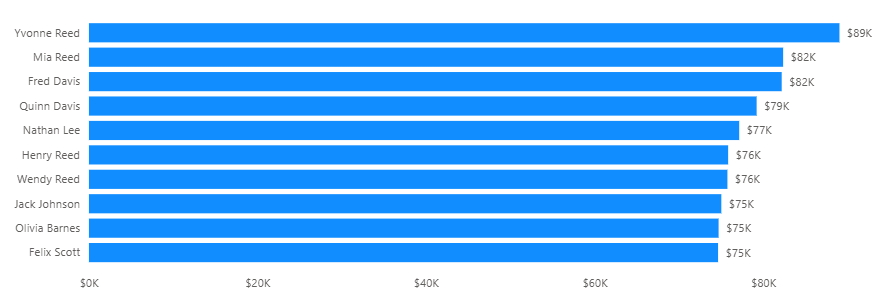
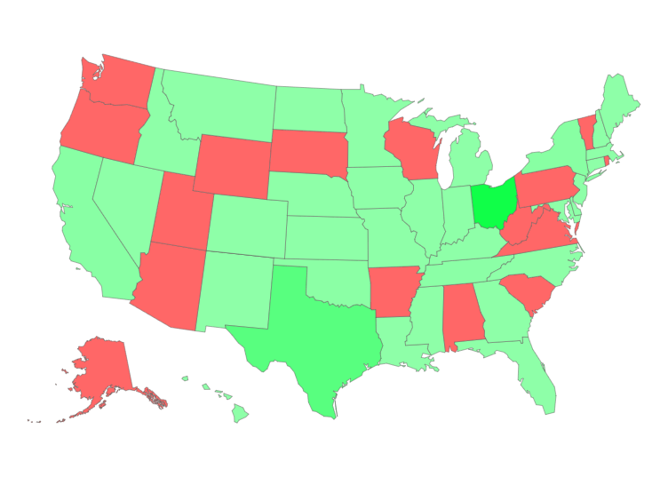
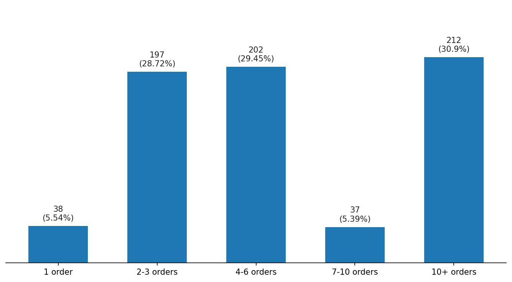
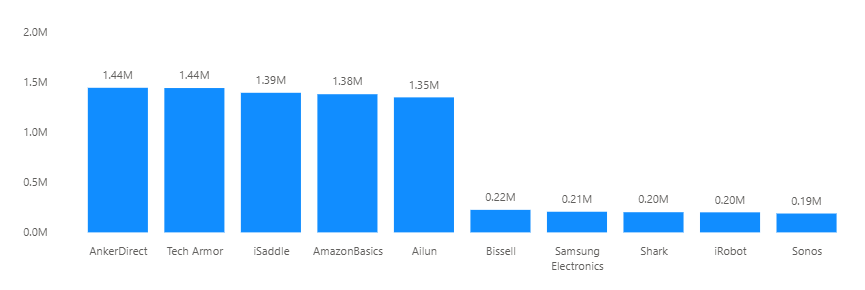
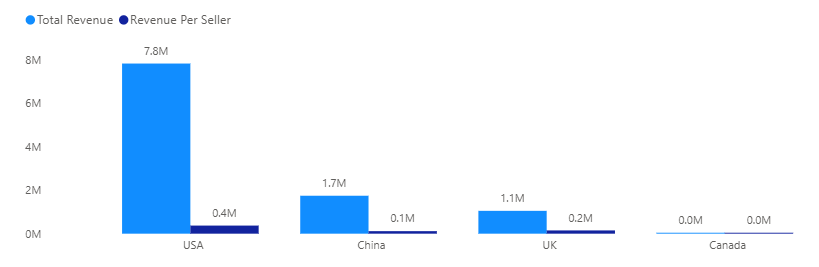
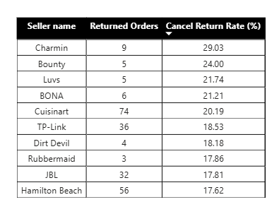
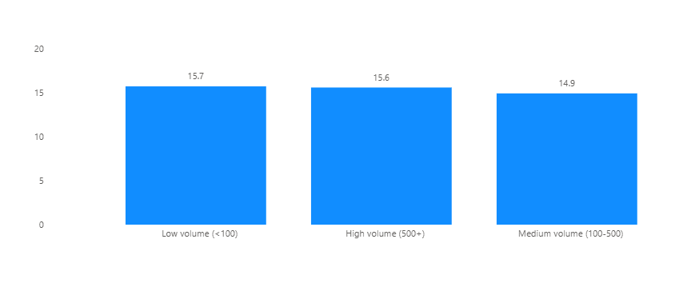
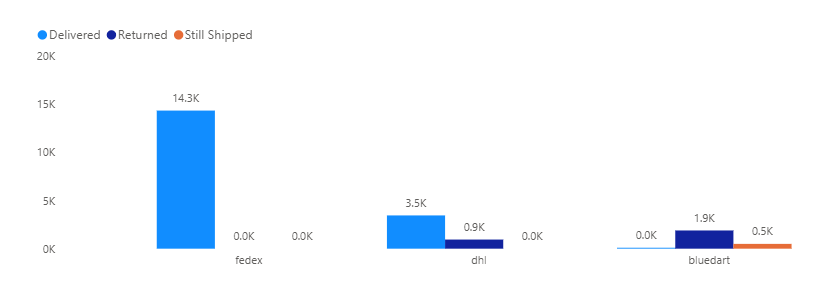
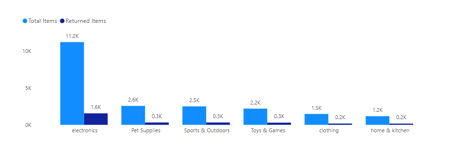
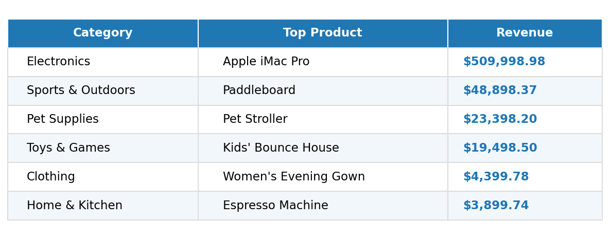

## Project Overview

This project analyses Amazon marketplace data using SQL as the primary analytical tool, with Power BI used only to visualize the resulting findings. It is designed to demonstrate strong SQL fundamentals, from data validation through advanced query techniques, applied to a real-world business analyst use case.

The dataset spans **9 relational tables** (Category, Products, Sellers, Inventory, Customers, Orders, Order_items, Payments, Shipping) covering **approximately 21,630 orders from January 2020 to July 2024**, loaded into a MySQL database (`Amazon_DB`).

The project is structured in two parts:

### 1. Data Validation & Trust Checks

Before any business analysis, the dataset is systematically validated. This includes checking referential integrity across all table relationships, identifying duplicates, and confirming there are no nulls or zero-values in fields critical to revenue and margin calculations. This step surfaced several genuine, non-error findings (for example, **212 customers who never placed an order**, and **488 cancelled orders with no shipping record**) that later fed directly into the business analysis.

### 2. 18 Business Questions

Organized across five sections (Sales & Revenue Performance, Customer Behaviour, Seller & Marketplace Performance, Operations, and Advanced/Strategic Synthesis), each question is answered with a documented SQL query, a plain-language insight explaining the finding, and a corresponding Power BI visualization. Techniques used include multi-table joins, CTEs, subqueries, conditional aggregation, and window functions such as `RANK()`, `ROW_NUMBER()`, and running totals with `PARTITION BY`.

**Key findings include:** Electronics drives **approximately 90% of total profit** despite being one of six categories. Ohio and Texas together account for **about 88% of total revenue**. Repeat customers generate **roughly 27 times more revenue** than one-time buyers. One shipping provider (Bluedart) shows a **near-total delivery failure rate**, flagged as a critical operational risk.

**Tools used**: MySQL (database and analysis), Power BI (visualization layer only).

## Business Objective

Amazon operates a large, multi-category marketplace connecting thousands of sellers with customers across the country. As the business scales, leadership needs visibility into where revenue and profit actually come from, which customers and sellers drive sustainable growth, and where operational risks such as payment failures or delivery breakdowns might be quietly eroding performance.

This project takes on the role of a business analyst tasked with answering that need. Using SQL to extract, validate, and analyze marketplace data, **the goal is to uncover actionable insights across sales performance, customer retention, seller reliability, and fulfilment operations.** The focus is not just on reporting numbers, but on identifying patterns, risks, and opportunities that could directly inform business strategy, such as diversification away from over-concentrated revenue sources, retention-focused customer initiatives, and vendor and provider performance reviews.

## Dataset

The dataset represents an Amazon-style e-commerce marketplace, structured across **9 relational tables** in a MySQL database (`Amazon_DB`). It covers approximately **21,630 orders placed between January 2020 and July 2024**, along with the customers, sellers, products, and fulfilment records tied to those orders.

| Table | Description |
|---|---|
| **Category** | Product category names (6 categories: Electronics, Clothing, Home & Kitchen, Sports & Outdoors, Pet Supplies, Toys & Games) |
| **Products** | Product name, price, cost of goods sold (COGS), and category |
| **Sellers** | Seller name and country of origin |
| **Inventory** | Stock levels and last restock date per product |
| **Customers** | Customer name and state |
| **Orders** | Order date, linked customer and seller, and order status (Completed, Cancelled, Returned, In Progress) |
| **Order_items** | Line-item detail for each order, including quantity and price per unit |
| **Payments** | Payment date and status (Payment Succussed, Payment Failed, Refunded) |
| **Shipping** | Shipping date, return date, shipping provider, and delivery status |

### Entity Relationship Diagram

.png)

All table relationships shown above were fully validated in the Data Validation & Trust Checks section before any analysis was performed, confirming referential integrity across the schema with no orphaned records.

**Data quality note:** Revenue data becomes unreliable after January 2024, dropping by approximately 95% and never recovering through the end of the dataset. This is treated as a data completeness limitation rather than a genuine business trend, and is flagged accordingly wherever it affects a finding (see Q2 and Q7).

## Tools & Technologies

- **MySQL** — database creation, data loading, and all analytical queries (joins, CTEs, subqueries, window functions, views)
- **Power BI** — visualization layer only, used to chart the results of each SQL query

## Project Structure

This project is organized as a single, linear document — each business question is presented with its SQL query, a Power BI visualization of the result, and a written finding, in that order. The structure moves from validating the data to answering progressively more advanced business questions.

**1. Data Validation & Trust Checks**
Foundational checks confirming the dataset is reliable before analysis begins:
- Relationship Integrity Checks (foreign key validation across all 6 table pairs)
- Duplicates (primary key and one-to-one relationship checks)
- Nulls / Zeros (fields critical to revenue and margin calculations)

**2. Business Questions (Q1–Q18)**
Organized into five sections, each grouping related questions and increasing in analytical complexity:

| Section | Questions | Focus |
|---|---|---|
| Sales & Revenue Performance | Q1–Q5 | Category profitability, revenue trends, top products, Pareto analysis, AOV |
| Customer Behavior | Q6–Q9 | Repeat vs. one-time buyers, top customers, revenue by state, order frequency |
| Seller & Marketplace Performance | Q10–Q13 | Seller revenue, performance by origin, cancellation/return rates |
| Operations: Shipping & Payments | Q14–Q16 | Payment failure rates, delivery success by provider, return rate by category |
| Advanced / Strategic Synthesis | Q17–Q18 | Top product per category (window functions), cumulative revenue trend |

## Data Validation & Trust Checks

### Relationship Integrity Checks

Verified referential integrity across all 6 foreign key relationships in the schema, checking each pair in both directions using LEFT JOIN anti-joins.

**Orders ↔ Customers**
```sql
-- Does every customer have at least one order?
select count(*) from Customers c
left join Orders o on c.Customer_id = o.Customer_id
where o.Customer_id is null;

-- Does every order point to a real, existing customer?
select count(*) from Orders o
left join Customers c on o.Customer_id = c.Customer_id
where c.Customer_id is null;
```
**Finding:** 212 customers (23.6% of the customer base) have never placed an order. This is not a data issue, simply customers who signed up but never purchased. No orphaned orders were found; every order is tied to a valid customer.

**Orders ↔ Order_items**
```sql
-- Does every order have at least one order item?
select count(*) from Orders o
left join Order_items oi on o.Order_id = oi.Order_id
where oi.Order_id is null;

-- Does every order item point to a real order?
select count(*) from Order_items oi
left join Orders o on oi.Order_id = o.Order_id
where o.Order_id is null;
```
**Finding:** Full referential integrity confirmed. Every order has at least one item, and every order item points to a valid order.

**Order_items ↔ Products**
```sql
-- Does every order item reference a real, existing product?
select count(*) from Order_items oi
left join Products p on oi.Product_id = p.Product_id
where p.Product_id is null;

-- Is there any product that has never been ordered?
select count(*) from Products p
left join Order_items oi on p.Product_id = oi.Product_id
where oi.Product_id is null;
```
**Finding:** All order items reference valid products. However, 15 products (out of 765) have never been ordered, worth flagging as potentially new, discontinued, or underperforming listings.

**Products ↔ Category**
```sql
-- Does every product belong to a real, existing category?
select count(*) from Products p
left join Category c on p.Category_id = c.Category_id
where c.Category_id is null;

-- Is there any category with no products in it?
select count(*) from Category c
left join Products p on c.Category_id = p.Category_id
where p.Product_id is null;
```
**Finding:** Every product is linked to a valid category, and every category contains at least one product. No orphaned records.

**Payments ↔ Orders**
```sql
-- Does every payment point to a real order?
select count(*) from Payments pay
left join Orders o on pay.Order_id = o.Order_id
where o.Order_id is null;

-- Does every order have a payment?
select count(*) from Orders o
left join Payments pay on o.Order_id = pay.Order_id
where pay.Order_id is null;
```
**Finding:** Every payment is linked to a valid order, and every order has a corresponding payment. No broken links in either direction.

**Shipping ↔ Orders**
```sql
-- Does every shipping record point to a real order?
select count(*) from Shipping s
left join Orders o on s.Order_id = o.Order_id
where o.Order_id is null;

-- Does every order have a shipping record?
select count(*) from Orders o
left join Shipping s on o.Order_id = s.Order_id
where s.Order_id is null;
```
**Finding:** Every shipping record is linked to a valid order. However, 488 orders have no shipping record. Further investigation confirmed all 488 are Cancelled orders, which correctly never shipped. This is expected behavior, not a data error.

**Overall Result:** Full referential integrity confirmed across all 6 table pairs. No broken foreign key relationships were found anywhere in the schema.

---

### Duplicates

Checked for duplicate primary keys and confirmed one-to-one relationships between Orders and its dependent tables (Payments, Shipping).

**Primary Key Duplicates**
```sql
-- Orders
select Order_id, count(Order_id)
from Orders
group by Order_id
having count(Order_id) > 1;

-- Customers
select Customer_id, count(Customer_id)
from Customers
group by Customer_id
having count(Customer_id) > 1;

-- Products
select Product_id, count(Product_id)
from Products
group by Product_id
having count(Product_id) > 1;
```
**Finding:** No duplicate primary keys found across Orders, Customers, or Products, confirming primary key constraints held correctly on import.

**One-to-One Relationship Checks**
```sql
-- Payments: does any order have more than one payment?
select Order_id, count(Order_id)
from Payments
group by Order_id
having count(Order_id) > 1;

-- Shipping: does any order have more than one shipping record?
select Order_id, count(Order_id)
from Shipping
group by Order_id
having count(Order_id) > 1;
```
**Finding:** No order has more than one payment record, and no order has more than one shipping record, confirming these are true one-to-one relationships as expected.

### Nulls / Zeros in Fields That Matter for Analysis

Checked for missing or zero values in fields critical to revenue, margin, and time-series calculations.

**Products: Price and COGS**
```sql
-- Price or COGS is null
select count(*) from Products
where Price is null or COGS is null;

-- Price or COGS is 0
select count(*) from Products
where Price = 0 or COGS = 0;

-- COGS greater than Price
select count(*) from Products
where COGS > Price;
```
**Finding:** No nulls or zero values in Price or COGS, and COGS never exceeds Price. Margin calculations in the Sales & Revenue section can be trusted, with no risk of negative or broken profit numbers.

**Order_items: Quantity and Price_per_unit**
```sql
-- Quantity or Price_per_unit is null
select count(*) from Order_items
where Quantity is null or Price_per_unit is null;

-- Quantity or Price_per_unit is 0
select count(*) from Order_items
where Quantity = 0 or Price_per_unit = 0;
```
**Finding:** No nulls or zero values in Quantity or Price_per_unit. Revenue calculations from Order_items can be trusted without risk of undercounting or division errors.

**Date Fields: Orders, Payments, Shipping**
```sql
-- Orders: Order_date is null
select count(*) from Orders
where Order_date is null;

-- Payments: Payment_date is null
select count(*) from Payments
where Payment_date is null;

-- Shipping: Shipping_date is null
select count(*) from Shipping
where Shipping_date is null;
```
**Finding:** No missing dates across Orders, Payments, or Shipping. All time-series and trend queries in later sections can run without risk of gaps or broken date logic.

---

**Data Validation Summary:** All checks across Relationship Integrity, Duplicates, and Nulls/Zeros came back clean, with three genuine (non-error) findings carried forward into the business analysis: 212 customers who never ordered, 15 products never sold, and 488 cancelled orders with no shipping record.

## Business Questions Answered

### Section 1: Sales & Revenue Performance

#### Q1: What is total revenue and profit by category, and which categories are most profitable?

**Query:**
```sql
select c.Category_name, 
       sum(oi.Quantity * oi.Price_per_unit) as Total_Revenue,
       sum(oi.Quantity * (oi.Price_per_unit - p.COGS)) as Total_Profit,
       round(sum(oi.Quantity * (oi.Price_per_unit - p.COGS)) * 100.0 / 
             (select sum(oi2.Quantity * (oi2.Price_per_unit - p2.COGS))
              from Order_items oi2
              join Products p2 on oi2.Product_id = p2.Product_id
              join Orders o2 on oi2.Order_id = o2.Order_id
              join Payments pay2 on o2.Order_id = pay2.Order_id
              where pay2.Payment_status = 'Payment Successed'), 2) as Profit_Contribution_Pct
from Order_items oi
join Products p on oi.Product_id = p.Product_id
join Category c on p.Category_id = c.Category_id
join Orders o on oi.Order_id = o.Order_id
join Payments pay on o.Order_id = pay.Order_id
where pay.Payment_status = 'Payment Successed'
group by c.Category_name;
```

**Visualization:**


**Finding:**
Electronics contributes nearly 90% of total profit (89.96%), an extreme concentration. Every other category combined accounts for roughly 10%. This signals a significant business risk: any disruption to Electronics (supply issues, demand shift, increased competition) would have an outsized impact on overall profitability. Diversification could be a strategic recommendation worth raising.

**Suggestion:** 
Consider building a category diversification strategy, even modest growth in Sports & Outdoors, Pet Supplies, or Toys & Games would meaningfully reduce dependence on Electronics without requiring it to underperform.

#### Q2: What are the monthly revenue trends over the last 4+ years, and is there any seasonality or decline?

**Query:**
```sql
select date_format(o.Order_date, '%Y-%m') as Order_Month,
       sum(oi.Quantity * oi.Price_per_unit) as Total_Revenue
from Order_items oi
join Orders o on oi.Order_id = o.Order_id
join Payments pay on o.Order_id = pay.Order_id
where pay.Payment_status = 'Payment Successed'
group by date_format(o.Order_date, '%Y-%m')
order by Order_Month;
```

**Visualization:**


**Finding:**
Revenue holds steady between $2.0M–$2.8M per year from 2020–2023, with mild seasonal dips in Jan–Feb and a modest peak in late summer. However, revenue collapses by roughly 95% starting February 2024 and never recovers through July 2024, the end of the dataset. This is almost certainly a data completeness artifact, since the dataset appears to stop being reliably populated after January 2024, rather than a genuine business decline.

**Suggestion:**
Investigate and resolve the data pipeline or reporting gap causing the post-January 2024 collapse before using this dataset for any forward-looking forecasting or planning.

#### Q3: What are the top 10 best-selling products by revenue, and do they differ from the top 10 by quantity sold?

**Query:**
```sql
-- Top 10 by revenue
select p.Product_name, 
       sum(oi.Quantity * oi.Price_per_unit) as Total_Revenue
from Order_items oi
join Products p on oi.Product_id = p.Product_id
join Orders o on oi.Order_id = o.Order_id
join Payments pay on o.Order_id = pay.Order_id
where pay.Payment_status = 'Payment Successed'
group by p.Product_name
order by Total_Revenue desc
limit 10;

-- Top 10 by quantity sold
select p.Product_name, 
       sum(oi.Quantity) as Total_Quantity_Sold
from Order_items oi
join Products p on oi.Product_id = p.Product_id
join Orders o on oi.Order_id = o.Order_id
join Payments pay on o.Order_id = pay.Order_id
where pay.Payment_status = 'Payment Successed'
group by p.Product_name
order by Total_Quantity_Sold desc
limit 10;
```

**Visualization:**

*Top 10 Products by Revenue*


*Top 10 Products by Quantity Sold*


**Finding:**
The top 10 products by revenue and top 10 by quantity sold have zero overlap. Revenue leaders are premium, low-volume electronics (Apple iMacs, MacBook Pros, high-end cameras), consistent with Electronics driving ~90% of total profit. Quantity leaders are inexpensive, high-volume items from Sports & Outdoors and Pet Supplies (resistance bands, soccer nets, dog beds). This confirms two distinct business dynamics: a small number of expensive electronics driving revenue and profit, while cheaper accessory-type products drive order volume and frequency.

**Suggestion:**
Run separate strategies for these two product groups, protect margins and availability on the premium electronics driving revenue, while using the high-volume accessory items to drive traffic, cross-sell, and customer acquisition.

#### Q4: What percentage of total revenue comes from the top 20% of products?

**Query:**
```sql
with Product_Revenue_Ranked as (
    select p.Product_name,
           sum(oi.Quantity * oi.Price_per_unit) as Product_Revenue,
           row_number() over (order by sum(oi.Quantity * oi.Price_per_unit) desc) as Revenue_Rank
    from Order_items oi
    join Products p on oi.Product_id = p.Product_id
    join Orders o on oi.Order_id = o.Order_id
    join Payments pay on o.Order_id = pay.Order_id
    where pay.Payment_status = 'Payment Successed'
    group by p.Product_name
)
select 
    sum(case when Revenue_Rank <= 149 then Product_Revenue else 0 end) as Top20pct_Revenue,
    sum(Product_Revenue) as Total_Revenue,
    round(sum(case when Revenue_Rank <= 149 then Product_Revenue else 0 end) * 100.0 / sum(Product_Revenue), 2) as Top20pct_Contribution_Pct
from Product_Revenue_Ranked;
```

**Visualization:**


**Finding:**
The top 20% of products (149 of 745) generate 79.71% of total revenue, closely matching the classic 80/20 Pareto pattern. This reinforces that revenue is highly concentrated in a relatively small set of high-value products, mostly premium electronics. From a strategy standpoint, protecting and growing this core product set matters far more than trying to boost the long tail of lower-revenue products.

**Suggestion:**
Prioritize inventory planning, marketing spend, and seller relationship management around the top 149 products, since protecting this core set has outsized impact compared to broad, evenly spread investment across the full catalog.

#### Q5: How does average order value (AOV) trend month over month?

**Query:**
```sql
select date_format(o.Order_date, '%Y-%m') as Order_Month,
       sum(oi.Quantity * oi.Price_per_unit) as Total_Revenue,
       count(distinct o.Order_id) as Total_Orders,
       round(sum(oi.Quantity * oi.Price_per_unit) / count(distinct o.Order_id), 2) as AOV
from Order_items oi
join Orders o on oi.Order_id = o.Order_id
join Payments pay on o.Order_id = pay.Order_id
where pay.Payment_status = 'Payment Successed'
group by date_format(o.Order_date, '%Y-%m')
order by Order_Month;
```

**Visualization:**


**Finding:**
AOV was consistently highest in 2020, particularly in January and February, and structurally declined from 2021 onward as order volume increased. 2024 sits clearly at the bottom of nearly every month, consistent with the data completeness issue identified earlier rather than a genuine demand drop. The ribbon view highlights how AOV rank between years shifts throughout the calendar year, though 2020 and 2024 remain the clearest outliers at the top and bottom respectively.

**Suggestion:**
Investigate what changed operationally or competitively around March 2021 (pricing strategy, new product mix, promotions) that caused the structural AOV drop, understanding the cause could inform whether raising AOV back up is a viable growth lever.

### Section 2: Customer Behaviour

#### Q6: What percentage of customers are repeat buyers vs. one-time buyers, and how much revenue does each group drive?

**Query:**
```sql
-- Customer count and % split
with Customer_Order_Counts as (
    select o.Customer_id, count(distinct o.Order_id) as Order_Count
    from Orders o
    group by o.Customer_id
)
select 
    case when Order_Count > 1 then 'Repeat' else 'One-time' end as Customer_Type,
    count(*) as Num_Customers,
    round(count(*) * 100.0 / sum(count(*)) over (), 2) as Pct_of_Customers
from Customer_Order_Counts
group by case when Order_Count > 1 then 'Repeat' else 'One-time' end;

-- Revenue by customer type
with Customer_Order_Counts as (
    select o.Customer_id, count(distinct o.Order_id) as Order_Count
    from Orders o
    group by o.Customer_id
),
Customer_Type_Labels as (
    select Customer_id,
           case when Order_Count > 1 then 'Repeat' else 'One-time' end as Customer_Type
    from Customer_Order_Counts
)
select ctl.Customer_Type,
       count(distinct ctl.Customer_id) as Num_Customers,
       sum(oi.Quantity * oi.Price_per_unit) as Total_Revenue,
       round(sum(oi.Quantity * oi.Price_per_unit) / count(distinct ctl.Customer_id), 2) as Revenue_Per_Customer
from Customer_Type_Labels ctl
join Orders o on ctl.Customer_id = o.Customer_id
join Order_items oi on o.Order_id = oi.Order_id
join Payments pay on o.Order_id = pay.Order_id
where pay.Payment_status = 'Payment Successed'
group by ctl.Customer_Type;
```

**Visualization:**


**Finding:**
94.46% of customers who have ordered at all are repeat buyers, and only 5.54% (38 customers) are one-time buyers. Repeat customers (616, about 90% of paying customers) generate an average of $17,266 in lifetime revenue per customer, about 27x more than one-time buyers ($647 average). This reinforces that customer retention drives the vast majority of revenue, and highlights that improving new-customer conversion into repeat buyers is likely the clearest growth lever for this business.

**Suggestion:**
Invest in improving the one-time-to-repeat conversion funnel (e.g., post-purchase email campaigns, second-order discounts), since even a small shift of one-time buyers into the repeat category would have an outsized revenue impact given the 27x value gap.

#### Q7: Who are the top 10 customers by lifetime spend?

**Query:**
```sql
select c.Customer_id, c.First_name, c.Last_name,
       sum(oi.Quantity * oi.Price_per_unit) as Lifetime_Spend
from Customers c
join Orders o on c.Customer_id = o.Customer_id
join Order_items oi on o.Order_id = oi.Order_id
join Payments pay on o.Order_id = pay.Order_id
where pay.Payment_status = 'Payment Successed'
group by c.Customer_id, c.First_name, c.Last_name
order by Lifetime_Spend desc
limit 10;
```

**Visualization:**



**Finding:**
Top 10 customers by lifetime spend range from $74,629 to $89,029, a relatively tight cluster rather than one dominant outlier, suggesting a genuine "top tier" segment rather than a single anomaly. These customers spend 4 to 5 times more than the average repeat customer ($17,266), making them a clear candidate for a VIP or loyalty program, or personalized retention outreach.

**Suggestion:**
Set up a formal VIP or loyalty tier for this top-spending segment, with personalized outreach or early access to new products, retaining these customers protects a disproportionate share of revenue.

#### Q8: Which states generate the most revenue and orders, and is there a regional concentration risk?

**Query:**
```sql
select c.State,
       count(distinct o.Order_id) as Total_Orders,
       sum(oi.Quantity * oi.Price_per_unit) as Total_Revenue
from Customers c
join Orders o on c.Customer_id = o.Customer_id
join Order_items oi on o.Order_id = oi.Order_id
join Payments pay on o.Order_id = pay.Order_id
where pay.Payment_status = 'Payment Successed'
group by c.State
order by Total_Revenue desc;
```

**Visualization:**



**Finding:**
Revenue is extremely concentrated geographically. Ohio alone accounts for 61.57% of total revenue, and Texas adds another 26.25%, meaning just two states generate 87.82% of all revenue. Of the 50 US states, only 34 have any recorded orders at all: Alabama, Alaska, Arizona, Arkansas, Oregon, Pennsylvania, Rhode Island, South Carolina, South Dakota, Utah, Vermont, Virginia, Washington, West Virginia, Wisconsin, and Wyoming show zero revenue during this period. This points to a genuinely limited market footprint rather than just an uneven distribution, and is worth investigating further as it may reflect the business's operational, shipping, or marketing reach rather than a lack of organic demand.

**Suggestion:**
Investigate whether the 16 zero-revenue states reflect a deliberate business decision (e.g., shipping limitations, marketing focus) or an untapped expansion opportunity, and evaluate the cost/benefit of expanding into 2-3 of the highest-potential states.

#### Q9: What does customer order frequency look like, and is there a loyal core of repeat customers?

**Query:**
```sql
with Customer_Order_Counts as (
    select o.Customer_id, count(distinct o.Order_id) as Order_Count
    from Orders o
    group by o.Customer_id
)
select 
    case 
        when Order_Count = 1 then '1 order'
        when Order_Count between 2 and 3 then '2-3 orders'
        when Order_Count between 4 and 6 then '4-6 orders'
        when Order_Count between 7 and 10 then '7-10 orders'
        else '10+ orders'
    end as Order_Frequency_Band,
    count(*) as Num_Customers,
    round(count(*) * 100.0 / sum(count(*)) over (), 2) as Pct_of_Customers
from Customer_Order_Counts
group by 
    case 
        when Order_Count = 1 then '1 order'
        when Order_Count between 2 and 3 then '2-3 orders'
        when Order_Count between 4 and 6 then '4-6 orders'
        when Order_Count between 7 and 10 then '7-10 orders'
        else '10+ orders'
    end
order by min(Order_Count);
```

**Visualization:**



**Finding:**
Customer order frequency is broadly spread rather than concentrated at either extreme. Only 5.54% of customers are one-time buyers, while nearly a third (30.90%) have placed 10+ orders, the single largest band, representing a genuinely loyal core. Frequency dips notably in the 7-10 order range, suggesting a possible drop-off point before customers either churn early or become true regulars. Combined with the earlier finding that repeat customers drive about 27x more revenue than one-time buyers, this indicates the business has a healthy retention engine, and the real opportunity is converting light repeat buyers (2-6 orders) into the loyal 10+ order segment.

**Suggestion:**
Design a targeted campaign for customers in the 2-6 order range to push them toward the 10+ order loyalty tier, since this middle segment represents the clearest volume opportunity for improving retention.

### Section 3: Seller & Marketplace Performance

#### Q10: Which sellers generate the most revenue, and how concentrated is the marketplace?

**Query:**
```sql
select s.Seller_id, s.Seller_name,
       count(distinct o.Order_id) as Total_Orders,
       sum(oi.Quantity * oi.Price_per_unit) as Total_Revenue
from Sellers s
join Orders o on s.Seller_id = o.Seller_id
join Order_items oi on o.Order_id = oi.Order_id
join Payments pay on o.Order_id = pay.Order_id
where pay.Payment_status = 'Payment Successed'
group by s.Seller_id, s.Seller_name
order by Total_Revenue desc;
```

**Visualization:**



**Finding:**
The top 5 sellers (AnkerDirect, Tech Armor, iSaddle, AmazonBasics, Ailun) generate 65.72% of total revenue, and the top 10 generate 75.3%, meaningful concentration, but more gradual than the extreme dominance seen in category or state analysis. These top sellers are tightly clustered ($1.34M-$1.44M each) rather than one outlier dominating, suggesting a competitive top tier. A long tail of about 25 sellers, mostly household or personal care brands, each generate under $10K, likely reflecting lower-demand product categories rather than seller underperformance.

**Suggestion:**
Monitor the top 5 sellers closely as key business partners, and consider whether onboarding a few more sellers with a similar product mix could add a second growth tier without over-relying on any single seller.

#### Q11: How does seller performance vary by origin (country)?

**Query:**
```sql
select s.Origin,
       count(distinct s.Seller_id) as Num_Sellers,
       count(distinct o.Order_id) as Total_Orders,
       sum(oi.Quantity * oi.Price_per_unit) as Total_Revenue,
       round(sum(oi.Quantity * oi.Price_per_unit) / count(distinct s.Seller_id), 2) as Revenue_Per_Seller
from Sellers s
join Orders o on s.Seller_id = o.Seller_id
join Order_items oi on o.Order_id = oi.Order_id
join Payments pay on o.Order_id = pay.Order_id
where pay.Payment_status = 'Payment Successed'
group by s.Origin
order by Total_Revenue desc;
```

**Visualization:**



**Finding:**
USA-based sellers dominate the marketplace, generating $372,909 per seller on average, 2.5x UK sellers, 3.2x China sellers, and over 100x Canadian sellers. Canada stands out as a striking outlier: 9 sellers generated only $31,747 combined revenue (about 22 orders per seller across the entire multi-year dataset), suggesting these may be newly onboarded sellers, a niche product category, or a distinct market segment rather than simple underperformance. Worth investigating further before drawing firm conclusions.

**Suggestion:**
Investigate the Canadian seller segment specifically, if it's due to onboarding timing or a logistics barrier, resolving it could unlock meaningful additional revenue given the seller count already in place.

#### Q12: Which sellers have the highest cancellation or return rates?

**Query:**
```sql
select s.Seller_id, s.Seller_name,
       count(distinct o.Order_id) as Total_Orders,
       sum(case when o.Order_status = 'Cancelled' then 1 else 0 end) as Cancelled_Orders,
       sum(case when o.Order_status = 'Returned' then 1 else 0 end) as Returned_Orders,
       round(sum(case when o.Order_status in ('Cancelled','Returned') then 1 else 0 end) * 100.0 
             / count(distinct o.Order_id), 2) as Cancel_Return_Rate_Pct
from Sellers s
join Orders o on s.Seller_id = o.Seller_id
group by s.Seller_id, s.Seller_name
order by Cancel_Return_Rate_Pct desc;
```

**Visualization:**



**Finding:**
The highest cancel/return rates cluster among small-volume sellers (Charmin, Bounty, Luvs, BONA, all under 35 total orders), where a handful of returns swings the percentage sharply; these are statistically less reliable as a "problem seller" signal. The more meaningful finding is Cuisinart, with 411 orders and a 20.19% cancel/return rate, a large enough sample to represent a genuine pattern worth investigating. Separately, the top-5 revenue sellers all sit in a tight 14.5-16.5% band despite very high order volumes, suggesting a fairly consistent baseline cancel/return rate across the marketplace's biggest players rather than a fulfillment issue specific to any one of them.

**Suggestion:**
Prioritize a quality or fulfilment review specifically for Cuisinart given its high-volume, high-rate combination, and treat the small-sample sellers as lower-priority monitoring items rather than urgent action items.

#### Q13: Is there a relationship between seller order volume and return rate?

**Query:**
```sql
with Seller_Stats as (
    select s.Seller_id, s.Seller_name,
           count(distinct o.Order_id) as Total_Orders,
           sum(case when o.Order_status in ('Cancelled','Returned') then 1 else 0 end) as Cancel_Return_Orders
    from Sellers s
    join Orders o on s.Seller_id = o.Seller_id
    group by s.Seller_id, s.Seller_name
)
select 
    case 
        when Total_Orders < 100 then 'Low volume (<100)'
        when Total_Orders between 100 and 500 then 'Medium volume (100-500)'
        else 'High volume (500+)'
    end as Volume_Tier,
    count(*) as Num_Sellers,
    sum(Total_Orders) as Total_Orders_Sum,
    sum(Cancel_Return_Orders) as Total_Cancel_Return,
    round(sum(Cancel_Return_Orders) * 100.0 / sum(Total_Orders), 2) as Avg_Cancel_Return_Rate_Pct
from Seller_Stats
group by 
    case 
        when Total_Orders < 100 then 'Low volume (<100)'
        when Total_Orders between 100 and 500 then 'Medium volume (100-500)'
        else 'High volume (500+)'
    end
order by min(Total_Orders);
```

**Visualization:**



**Finding:**
Cancel/return rate is essentially flat across seller volume tiers: low volume (15.73%), medium volume (14.93%), and high volume sellers (15.60%) all cluster within about 1 percentage point of each other. Seller size has no meaningful relationship with quality or fulfillment performance. This reframes the earlier Q12 finding: standout sellers like Cuisinart are seller-specific outliers rather than evidence of a broader tier-wide pattern.

**Suggestion:**
Since seller size isn't a reliable predictor of return rate, focus quality improvement efforts on individual seller-level investigation rather than volume-based policies or thresholds.

### Section 4: Operations - Shipping & Payments

#### Q14: What is the payment failure rate, and does it cluster around specific sellers?

**Query:**
```sql
-- Overall payment status breakdown
select Payment_status,
       count(*) as Num_Payments
from Payments
group by Payment_status;

-- Failure rate by seller (sellers with 100+ payments only)
select s.Seller_name,
       count(*) as Total_Payments,
       sum(case when pay.Payment_status = 'Payment Failed' then 1 else 0 end) as Failed_Payments,
       round(sum(case when pay.Payment_status = 'Payment Failed' then 1 else 0 end) * 100.0 
             / count(*), 2) as Failure_Rate_Pct
from Payments pay
join Orders o on pay.Order_id = o.Order_id
join Sellers s on o.Seller_id = s.Seller_id
group by s.Seller_id, s.Seller_name
having Total_Payments >= 100
order by Failure_Rate_Pct desc
limit 10;
```

**Visualization:**


**Finding:**
Overall payment success rate is 84.61%, with 2.26% failed payments and 13.13% refunded. Payment failure rate holds steady around 2-4% across all sellers with meaningful volume, even the highest sellers (Shark at 3.75%, Hamilton Beach at 3.72%) are barely above the marketplace average. No evidence of failures concentrating around specific sellers; this looks like normal transactional noise rather than a seller-specific issue.

**Suggestion:**
No immediate action needed on payment failures given the consistent, low baseline rate, but continue monitoring in case any single seller's rate begins to diverge meaningfully from the marketplace average.

#### Q15: What is the delivery success rate by shipping provider, and is one provider underperforming?

**Query:**
```sql
select Shipping_providers,
       count(*) as Total_Shipments,
       sum(case when trim(Delivery_status) = 'Delivered' then 1 else 0 end) as Delivered,
       sum(case when trim(Delivery_status) = 'Returned' then 1 else 0 end) as Returned,
       sum(case when trim(Delivery_status) = 'Shipped' then 1 else 0 end) as Still_Shipped,
       round(sum(case when trim(Delivery_status) = 'Delivered' then 1 else 0 end) * 100.0 
             / count(*), 2) as Delivery_Success_Rate_Pct
from Shipping
group by Shipping_providers
order by Delivery_Success_Rate_Pct desc;
```

**Visualization:**



**Finding:**
Delivery performance varies enormously by provider. FedEx has a perfect 100% delivery success rate across all 14,346 shipments. DHL performs reasonably at 78.47%, with 948 shipments returned. Bluedart is a severe outlier: only 1 of 2,392 shipments (0.04%) shows as successfully delivered, with 79% returned and another 499 stuck in "Shipped" status unresolved. This is either a critical fulfillment failure specific to Bluedart or a data and tracking integration issue with that provider, and warrants immediate investigation given the risk to customer experience.

**Suggestion:**
Immediately escalate the Bluedart relationship for review, either to resolve a critical fulfilment issue or correct a data/tracking integration problem, and consider temporarily rerouting shipments through FedEx or DHL until resolved.

#### Q16: What is the return rate by product category?

**Query:**
```sql
select c.Category_name,
       count(distinct oi.Order_item_id) as Total_Items,
       sum(case when trim(s.Delivery_status) = 'Returned' then 1 else 0 end) as Returned_Items,
       round(sum(case when trim(s.Delivery_status) = 'Returned' then 1 else 0 end) * 100.0 
             / count(distinct oi.Order_item_id), 2) as Return_Rate_Pct
from Order_items oi
join Products p on oi.Product_id = p.Product_id
join Category c on p.Category_id = c.Category_id
join Orders o on oi.Order_id = o.Order_id
join Shipping s on o.Order_id = s.Order_id
group by c.Category_name
order by Return_Rate_Pct desc;
```

**Visualization:**



**Finding:**
Return rates are fairly consistent across categories, ranging from 11.86% (Clothing) to 14.46% (Home & Kitchen), no category shows a dramatic outlier. Notably, Electronics sits mid-pack at 13.87% despite driving about 90% of total profit, meaning the business's heavy reliance on Electronics isn't compounded by elevated return risk in that category. Home & Kitchen has the highest return rate, which could point to sizing, fit, or product-description accuracy issues worth investigating, though the gap from the average is modest.

**Suggestion:**
Take a closer look at Home & Kitchen product listings and sizing information to identify whether return causes are addressable (e.g., better product descriptions or images), though this is a lower-priority item given the modest gap from average.

### Section 5: Advanced / Strategic Synthesis

#### Q17: Which product ranks #1 by revenue within each category?

**Query:**
```sql
with Product_Revenue_By_Category as (
    select c.Category_name, p.Product_name,
           sum(oi.Quantity * oi.Price_per_unit) as Product_Revenue,
           rank() over (partition by c.Category_name order by sum(oi.Quantity * oi.Price_per_unit) desc) as Rank_In_Category
    from Order_items oi
    join Products p on oi.Product_id = p.Product_id
    join Category c on p.Category_id = c.Category_id
    join Orders o on oi.Order_id = o.Order_id
    join Payments pay on o.Order_id = pay.Order_id
    where pay.Payment_status = 'Payment Successed'
    group by c.Category_name, p.Product_name
)
select Category_name, Product_name, Product_Revenue
from Product_Revenue_By_Category
where Rank_In_Category = 1
order by Product_Revenue desc;
```

**Visualization:**


**Finding:**
The revenue leader within each category varies dramatically in scale. The Apple iMac Pro (Electronics) generates $509,998.98, more than 100x the top product in Home & Kitchen ($3,894.79, Espresso Machine). This illustrates the Electronics concentration finding from earlier: a single flagship product effectively anchors the business's overall revenue and profit performance.

**Suggestion:**
Treat these category-leading products as anchor items in merchandising and marketing, ensuring they never go out of stock, since each one appears to single-handedly drive a disproportionate share of its category's performance.

#### Q18: What does the cumulative revenue trend look like, and which month crosses 50% of each year's total revenue?

**Query:**
```sql
with Monthly_Revenue as (
    select year(o.Order_date) as Order_Year,
           date_format(o.Order_date, '%Y-%m') as Order_Month,
           sum(oi.Quantity * oi.Price_per_unit) as Monthly_Revenue
    from Order_items oi
    join Orders o on oi.Order_id = o.Order_id
    join Payments pay on o.Order_id = pay.Order_id
    where pay.Payment_status = 'Payment Successed'
    group by year(o.Order_date), date_format(o.Order_date, '%Y-%m')
)
select Order_Year, Order_Month, Monthly_Revenue,
       sum(Monthly_Revenue) over (partition by Order_Year order by Order_Month) as Running_Total,
       sum(Monthly_Revenue) over (partition by Order_Year) as Year_Total,
       round(sum(Monthly_Revenue) over (partition by Order_Year order by Order_Month) * 100.0 
             / sum(Monthly_Revenue) over (partition by Order_Year), 2) as Pct_Of_Year_Revenue
from Monthly_Revenue;
```

**Finding:**
From 2020-2023, cumulative revenue consistently crosses the 50% mark in June or July each year, a remarkably stable pattern suggesting steady, mildly seasonal revenue growth rather than a single dominant sales spike. 2024 appears to cross 50% in January, but this is a data artifact: the 2024 total is only $391,428 due to the data completeness issue identified earlier, so this figure should not be interpreted as a genuine early-year sales surge.

**Suggestion:**
Use the consistent June/July 50% crossover point as a benchmark for future revenue pacing and forecasting, and treat any year that deviates meaningfully from this pattern as an early signal worth investigating.


## Project at a Glance

| Category | Details |
|---|---|
| Database | MySQL |
| Tables | 9 |
| Orders Analyzed | 21,630+ |
| Business Questions | 18 |
| Analysis Type | SQL-Driven Business Analysis |
| Focus Areas | Customers, Products, Sellers, Orders, Payments & Shipping |
| SQL Techniques | Joins, CTEs, Subqueries, CASE, Aggregations & Window Functions |

## Key Business Insights

- Electronics contributes 89.96% of total profit, creating significant category concentration risk.
- The top 20% of products generate 79.71% of total revenue, closely following the Pareto principle.
- The top 10 products by revenue have zero overlap with the top 10 products by quantity sold, showing different high-value and high-volume product segments.
- Repeat customers generate significantly higher revenue per customer than one-time buyers.
- 212 registered customers have never placed an order.
- 15 products have never been ordered, highlighting potential underperforming or inactive listings.
- 488 orders have no shipping record; investigation confirmed that all were cancelled orders, so this was expected rather than a data-quality issue.
- Revenue drops by approximately 95% after January 2024, indicating a likely data-completeness issue rather than a genuine business decline.

## Business Recommendations

1. **Reduce Category Concentration**
   - Develop profitable non-Electronics categories to reduce dependence on Electronics.

2. **Focus on Customer Retention**
   - Target one-time customers with personalized offers and retention campaigns to increase repeat purchases.

3. **Protect High-Value Products**
   - Prioritize inventory and seller management for the products responsible for the majority of revenue.

4. **Improve Marketplace Operations**
   - Review seller cancellation and shipping-provider performance to identify operational risks.

5. **Investigate Data Completeness**
   - Resolve the post-January 2024 revenue data gap before using the dataset for forecasting or trend-based decisions.

## SQL Skills Demonstrated

- Data Validation & Quality Checks
- INNER JOIN / LEFT JOIN
- CTEs
- Subqueries
- CASE Statements
- GROUP BY & HAVING
- Aggregate Functions
- Conditional Aggregation
- Window Functions
- RANK()
- ROW_NUMBER()
- Running Totals
- Percentage Calculations
- SQL Views

## Key Learnings

Through this project, I strengthened my ability to:

- Validate relational datasets before performing analysis.
- Translate business problems into SQL queries.
- Work with multiple related tables using JOINs.
- Use CTEs and subqueries to structure complex analysis.
- Apply window functions such as RANK(), ROW_NUMBER(), and LAG().
- Perform customer, product, seller, sales, payment, and shipping analysis.
- Identify data-quality issues and distinguish them from genuine business conditions.
- Convert SQL results into actionable business recommendations.


